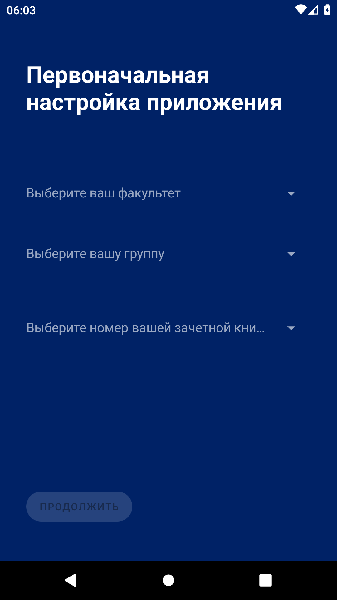
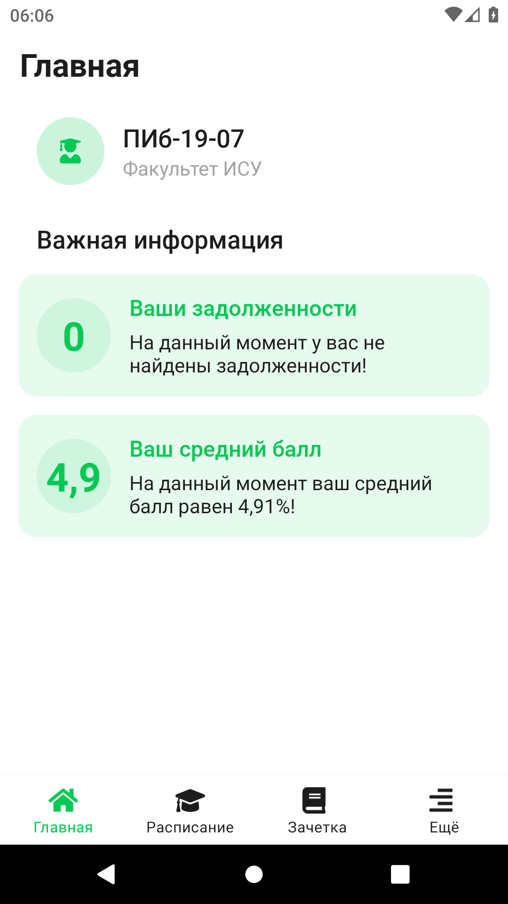
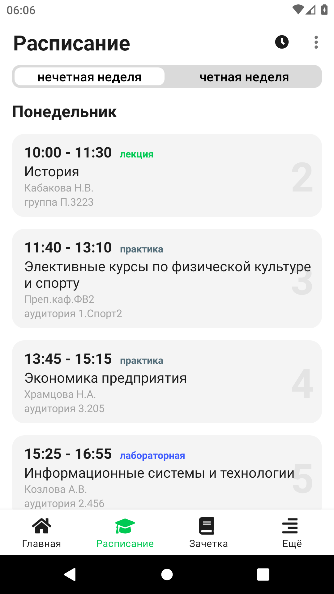
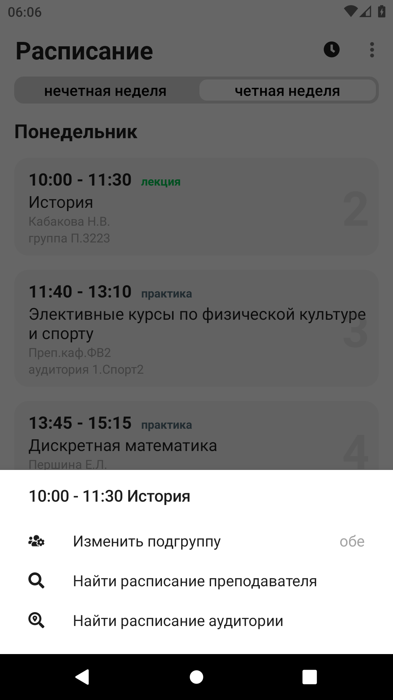

# Мобильное приложение "СибАДИ.Студент"

**Дипломная работа на тему: "Разработка мобильного приложения для студента на основе данных открытых источников вуза"**

Приложение обеспечивает возможность выполнения перечисленных ниже функций:
- возможность авторизации пользователя;
- возможность получения информации о расписании дисциплин группы;
- возможность выбора четной/нечетной недели в расписании дисциплин группы;
- возможность изменения/выбора подгруппы у дисциплины;
- возможность получения информации из электронной зачетной книжки студента;
- возможность получения информации об учебном графике группы;
- возможность отображения задолженностей, среднего балла студента;
- возможность отображения экзаменов и зачетов группы;
- возможность поиска расписания преподавателей/аудиторий;
- возможность добавления/редактирования/удаления заметок;
- возможность выбора периодичности обновления данных;
- возможность функционирования приложения без постоянного интернет-подключения;
- возможность изменения стартовой вкладки;
- возможность переключения темного режима пользовательского интерфейса.

> **Карта процессов приложения**

> **Первоначальная настройка приложения**

На странице первоначальной настройки приложения, пользователю необходимо выбрать факультет, группу и номер зачетной книжки из выпадающего списка. После выбора всех данных станет доступна кнопка «Продолжить», нажав на которую будет осуществлен переход на страницу «Главная». Страница с первоначальной настройкой приложения будет открываться только в том случае, если пользователь установил приложение и не завершил его настройку или стер данные приложения. В иных случаях будет открываться страница «Главная» или любая другая страница, выбранная пользователем в настройках приложения.

> **Главная страница приложения**

На странице «Главная», представлена персональная информация пользователя приложения (студента):
– номер зачетной книжки;
– наименование группы и факультета;
– задолженности по дисциплинам;
– средний балл электронной зачетной книжки;
– информация о ближайших зачетах и экзаменах.

> **Расписание дисциплин группы**

На странице «Расписание», отображается расписание дисциплин на текущий день и тип недели. При необходимости, пользователь может посмотреть расписание звонков, нажав на значок часов в правом верхнем углу. Также, у пользователя имеется возможность изменить тип отображаемой недели, переключая на «четную» или «нечетную» неделю соответственно, помимо этого, перелистывая область с расписанием можно просматривать расписание на любой другой день.
В целях повышения комфортности использования приложения, в пользовательском интерфейсе предусмотрена нумерация пар по счету, а также используются разные цвета, для быстрого ориентирования в типах дисциплин, которые приведены ниже:
– Практика – серый.
– Лекция – зеленый.
– Лабораторная – синий.
– Экзамен – красный.
– Зачет – оранжевый.
Для отображения дополнительных возможностей, необходимо нажать и удерживать по дисциплине, пока не всплывет карточка выбранной дисциплины. В данной карточке будет отображены: наименование, время начала и окончания пары, а также возможность изменения подгруппы и поиска расписания преподавателя или аудитории.

> **Электронная зачетная книжка студента**

На странице «Зачетка», отображается электронная зачетная книжка студента, которая сгруппирована по типам контроля. Каждая дисциплина содержит информацию о номере семестра, в котором она была проведена, ФИО преподавателя, количестве часов по учебному плану и полученной оценке. О том, какая оценка получена по тому, или иному предмету, информирует цвет текста оценки. Цвет варьируется в зависимости от полученного результата:
– Отлично, зачет – зеленая.
– Хорошо – синяя.
– Удовлетворительно – желтая.
– Неудовлетворительно, незачет – красная.

> **Страница "Еще"**

На странице «Еще», отображены дополнительные пункты приложения, на которых пользователь имеет возможность:
– изменить основную цветовую схему приложения переключив пункт «темный режим»;
– найти преподавателя по фамилии и просмотреть его расписание;
– найти и просмотреть расписание аудитории по номеру;
– просмотреть учебный график;
– просмотреть собственные заметки;
– перейти к настройкам приложения;
– увидеть информацию о приложении.

> **Поиск расписания дисциплин по номеру аудитории/ФИО преподавателя**

> **Расписание дисциплин аудитории/преподавателя**

На страницах «Расписание преподавателя» и «Расписание аудиторий», отображается расписание дисциплин у конкретного преподавателя или у конкретной аудитории, для которой был осуществлен поиск. Также, как и на странице «Расписание», имеется возможность изменить тип отображаемой недели, переключая на «четную» или «нечетную» неделю соответственно, помимо этого можно просматривать расписание на любой другой день перелистывая область с расписанием. Возможность изменения или выбора подгруппы отсутствует, в связи с тем, что данное расписание дисциплин доступно только при наличии интернет-подключения в режиме просмотра.

> **Учебный график группы**

На странице «Учебный график», отображается график зачетов и экзаменов, который сгруппирован по типам контроля. Каждая дисциплина содержит информацию о дате проведения контроля, ФИО преподавателя, количестве часов по учебному плану и об аббревиатуре кафедры, на которой данная дисциплина читается.

> **Страница "Заметки"**

На странице «Заметки», отображаются все созданные заметки пользователем. Для доступа к дополнительным возможностям, необходимо нажать и удерживать одну из заметок, пока не всплывет карточка выбранной заметки. В карточке заметки можно: открыть данную заметку для просмотра и редактирования или удалить ее навсегда.
Для добавления новой заметки пользователю необходимо нажать по значку, находящемуся в правом нижнем углу, после чего будет осуществлен переход на страницу с добавлением новой заметки. На данной странице пользователю будет необходимо заполнить заголовок и описание заметки, и затем нажать на значок в правом нижнем углу, после чего новая заметка будет добавлена и отобразится на странице «Заметки».

> **Добавление/редактирование новой заметки**

> **Настройки приложения**

На странице «Настройки», пользователь может: изменить подгруппу по умолчанию для удобного просмотра расписания дисциплин, стартовую вкладку, периодичность обновления информации, касающуюся электронной зачетной книжки и расписания дисциплин, а также удалить все личные данные.

> **Темный режим**

**Видео демонстрация мобильного приложения "СибАДИ.Студент"**

